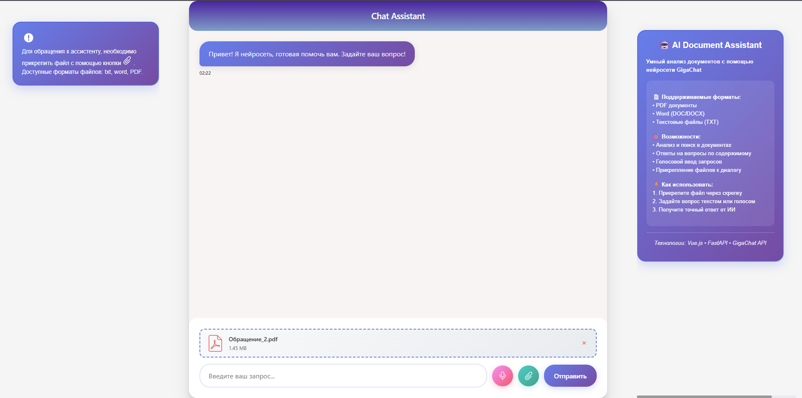

# ИИ-помощник на основе GigaChat



Сервис ИИ-помощник на основе GigaChat, который позволяет анализировать документы, задавать вопросы по их содержимому и получать качественные ответы.

## Основные возможности

- **Интеллектуальная обработка документов** - загрузка и анализ PDF, Word и TXT файлов
- **Контекстные ответы** - получение точных ответов на основе загруженных материалов
- **Простое взаимодействие** - удобный интерфейс для общения с ИИ-помощником
- **Голосовой ввод** - возможность задавать вопросы голосом
- **Поддержка различных форматов** - работа с PDF, DOC/DOCX, TXT

## Технологический стек

### Backend
- **Python** с FastAPI framework
- **GigaChat API** - интеграция с нейросетью от Сбера
- **pdfplumber** - обработка PDF-файлов
- **python-docx** - обработка Word документов

### Frontend
- **Vue.js** - современный фреймворк
- **Адаптивный UI** - красивый и удобный интерфейс

## Установка и настройка

### Предварительные требования
- Python 3.8+
- Node.js 14+
- Токен GigaChat API

### Установка зависимостей:

```bash
# Backend зависимости
pip install fastapi uvicorn pdfplumber python-docx gigachat

# Frontend зависимости
cd frontend
npm install