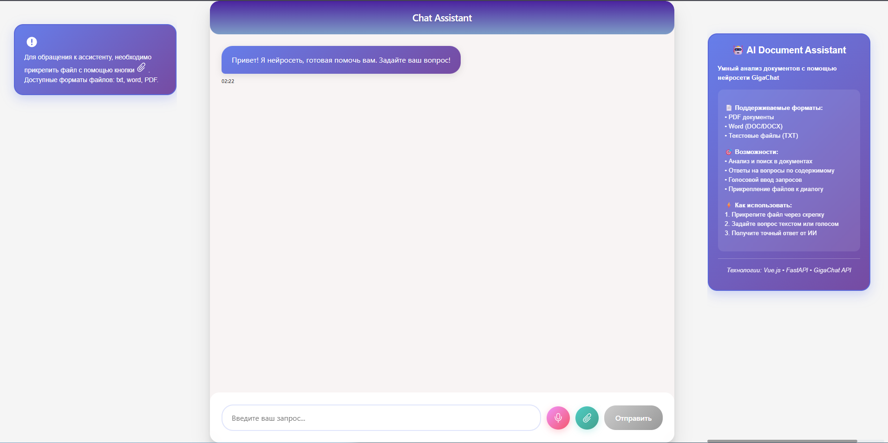

# ИИ-помощник на основе GigaChat



Сервис ИИ-помощник на основе Gigachat, который позволяет взаимодействовать со справочным материалом по машиностроительному оборудованию, задавать вопросы по материалу и получать качественные ответы.

## Основные возможности

- **Интеллектуальная обработка документов** - загрузка и анализ PDF-файлов
- **Контекстные ответы** - получение точных ответов на основе загруженных материалов
- **Простое взаимодействие** - удобный интерфейс для общения с ИИ-помощником
- **Поддержка различных форматов** - работа с PDF

## Технологический стек

### Backend
- **Python** с Flask framework-ом
- **GigaChat API** - интеграция с нейросетью от Сбера
- **Supabase** - облачная база данных
- **PyPDF2** - обработка PDF-файлов

### Frontend
- **Vue** с современным UI
- **Flask** - кросс-доменные запросы

## Установка и настройка

### Предварительные требования
- Python 3.13+
- Node.js
- Аккаунт Supabase
- Токен GigaChat

### Установка зависимостей:

```bash
# Backend зависимости
pip install supabase, requests, PyPDF2, gigachat, pdf2docx, flask, flask_cors

# Frontend зависимости
cd Sber/Frontend
npm install
```
### Таблица для БД:

```sql
CREATE TABLE pdf_files (
    id BIGSERIAL PRIMARY KEY,
    name TEXT NOT NULL,
    storage_path TEXT NOT NULL,
    file_url TEXT,
    file_size BIGINT,
    uploaded_at TIMESTAMPTZ DEFAULT NOW(),
    gigachat_file_id TEXT,
    txt_path TEXT,
    processed_path TEXT
);

ALTER TABLE pdf_files DISABLE ROW LEVEL SECURITY;
```
### Запуск сервера:

```bash
cd Sber/Backend/server
py server.py
```
### Запуск клиента:

```bash
cd Sber/Frontend
npm run dev
```
Перед запуском убедитесь, что:
Указаны корректные учетные данные Supabase
Установлен действительный токен GigaChat